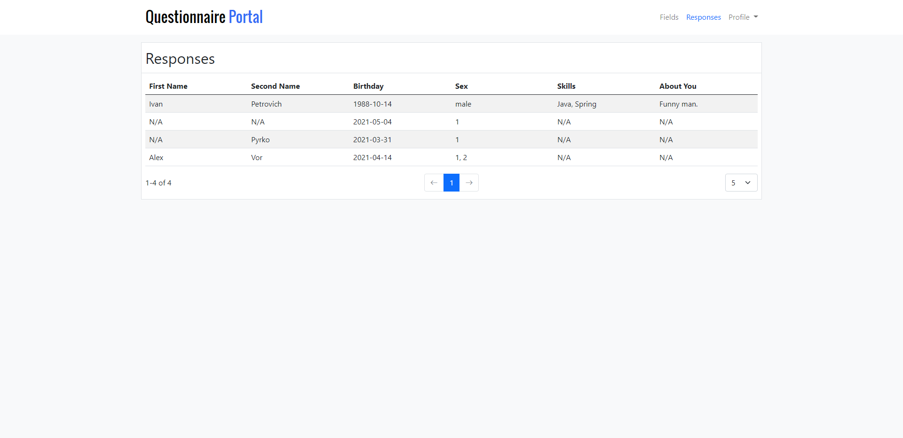

# Questionnaire Portal
Java web application for collection data from users

## Table of contents
1. [General info](#General-info)
2. [Used technologies](#Used-technologies) 
3. [Installation](#Installation) 
4. [Main classes description](#Main-classes-description) 
5. [Screenshots](#Screenshots) 
---

## General info
Questionnaire Portal is Java Web Application, that allows collect data from users.
It provides opportunity to dynamically creation, modifying, removing questions (a.k. fields) in form.

## Used technologies
- Java 16
- Spring Boot
- Spring Security
- Websocket
- Spring Data, JPA, Hibernate
- Postgre SQL
- VueJS 3
- Bootstrap 5
- Maven

## Installation
1. Clone this repo
2. Configure *application.properties* file
3. Run

## Main classes description

* ### controller.config classes
    Contains additional Spring configuration
* ### AnswerController.java
    Controller for operations, connected with answers.
* ### FieldsController.java
    Controller for operations, connected with fields.
* ### RegistrationController.java
    Controller for user registration.
* ### UserProfileController.java
    Controller for user profile operations.
* ### AnswerService.java
    Provides methods for creating and reading answers.
* ### FieldService.java
  Provides CRUD operations for fields.
* ### MailService.java
  Provides mail sending functional.
* ### UserService.java
  * Provides methods for creating, reading and modifying users.
  * Implements *UserDetailsService.java* interface for Spring Security.
* ### validator classes
    Contains custom validators and validation annotations.

## Screenshots
### Login Page

### Registration Page

### Edit Profile Page

### Change Password Page

### Fields Page

### Responses Page

### Main Form Page

### Success Page
